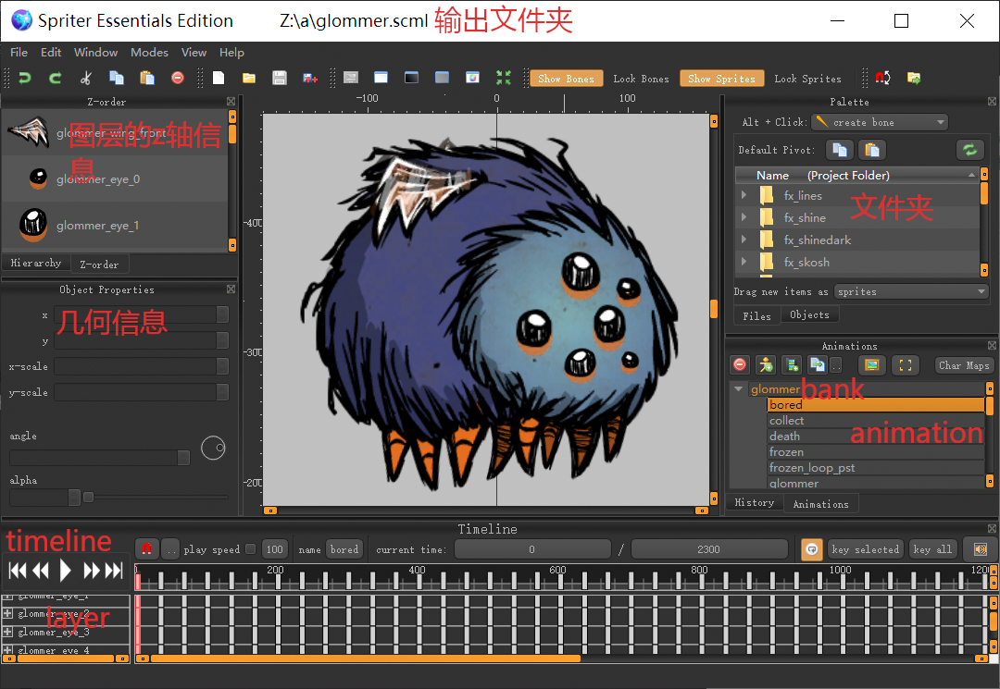

# 练习-动画ANIM

在本练习中，你将学会转换动画文件，使用spriter，并初步了解动画系统。

我们使用格洛姆的动画作为本次练习的案例。它在anim/glommer.zip里。（什么？你连这个文件都找不到？不会吧不会吧。）解压到一个你喜欢的文件夹，然后打开terminal/shell/cmd/无论什么命令行程序，开始吧。

## 1 工具箱

这些工具可以在https://github.com/ZzzzzzzSkyward/DSTmodutils中下载，如果你没有的话。

如果你还不会使用git，那么就点击Code，然后Download Zip。但既然你都能访问github了，用git clone一下也不是什么难事了。

### 1.1 TEX Tool


饥荒中的动画的结构为

1. anim.bin，存放动画信息
2. build.bin，存放图集信息
3. atlas.tex，存放图集本身

一个东西（比如prefab、widget）可以有多个build，每个build可以有多个atlas，但如果有anim的话我猜只能有一个（更确切地说是layer（图层）需要一致）。

TEX Tool是一组拥有GUI的tex文件查看程序，在textool文件夹里有TEXTool.exe与TEXCreator.exe，前者是查看器，后者是转换器。TEXTool.exe能够打开atlas.tex，如果同时又有一个同名的.xml文件，那么就能加载出图集信息，但因为我们现在只有build.bin，这是一个由Klei压缩过的二进制文件，无法被读取，所以图集信息是没有的。


在有图集信息的情况下，图中灰色选框将变成可选状态。

另外一个程序TEXCreator.exe没有用处，我不做介绍。

### 1.2 BuildRenamer.exe

这个工具用来对build进行重命名。

### 1.3 krane与ktech

这是两个非常重要的工具，krane负责转换动画文件anim，ktech负责转换图集文件atlas。需要注意的是krane的必需参数为anim，但有些情况下我们不需要anim，只需要build（由于build总是与atlas配套，所以我默认只提build不提atlas了），那么可以从游戏文件中提取出一个对应的anim.bin，转换后在zip文件里删除anim.bin。

流程为：包含build的zip与包含anim的zip，解压后用krane转换成scml，编辑scml，然后再用autocompiler转换成zip，删除zip里的anim，只留下build与atlas。

**关于转换出来的动画的问题，请去Spriter介绍那里查阅**

现在请打开命令行程序，输入（具体请看我写的工具说明）

```bash
krane 输入文件夹/ 输出文件夹/
#然后会出现以下信息
Loading build from `.\build.bin'...
Loading atlas from `.\atlas-0.tex'...
Loading anims from `.\anim.bin'...
Splicing build atlas...
Saving frame images...
Writing scml...
Done.
```

（什么？你连怎么使用命令行都不会？不会吧不会吧）

### 1.4 autocompiler.exe

请在Steam里下载工具`Don't Starve Mod Tools`，里面有一个autocompiler.exe。下载了这个工具后每次启动饥荒都会先运行一遍。

这个程序扫描饥荒的mods文件夹，如果发现不是以`workshop-`开头的本地mod就会编译这个文件夹。编译规则是images文件夹里的png转换成tex与xml（上文说TEXTool需要xml文件）；exported文件夹里的scml转换成zip放到anim文件夹，同时生成一个中间产品zip。

因此一个mod的文件夹结构形如：

```
my-mod/
	modinfo.lua
	modmain.lua
	modicon.tex
	modicon.xml
	images/
		*.tex
		*.xml
	anim/
		*.zip{anim.bin,build.bin,atlas.tex}
	scripts/
		/xxx/
			*.lua
		*.lua
	sound/
		*.fev
		*.fsb
	bigportraits/
		*.tex
		*.xml
	exported/
		/xxx/
			*.scml
```

但是你不会在发布的mod里看到`exported`文件夹，它不应该被发布出来。

注意，autocompiler.exe具有很大的局限性，而且很可能存在bug。我已经遇到了此问题，但放心，我们这个练习与此无关。

### 1.5 Spriter

首先，不要使用`Don't Starve Mod Tools`提供的Spriter，那个版本太旧了。你可以去网上找破解版Spriter Pro，如果找得到的话记得也给我发一份。

用Spriter打开glommer.scml。记住一些单词：

- bank=glommer（一级标题）
- build=glommer（这个scml文件的名字）
- animation=bored/collect/...（二级标题）
- layer=图层
- timeline=时间轴
- frame=帧
- symbol=一个图层内的图片（不能理解成一张图片，因为动画的不同帧里图片可以不是同一张）=一个文件夹内的图片



于是你就可以愉快地修改了。

## 2 动画系统的函数

饥荒的动画系统代码在c/c++层，我们读不到，只能通过Klei在代码中留下的蛛丝马迹、草蛇灰线，顺藤摸瓜、盲人摸象。

以下是2021年6月Hornete（https://forums.kleientertainment.com/forums/topic/126774-documentation-list-of-all-engine-functions/ ）遍历动画系统打印出来的全体函数。但时间过去这么久了，Klei肯定加新函数了吧。

**AnimState**

```
AddOverrideBuild
AnimDone
AssignItemSkins
BuildHasSymbol
ClearAllOverrideSymbols
ClearBloomEffectHandle
ClearOverrideBuild
ClearOverrideSymbol
ClearSymbolExchanges
CompareSymbolBuilds
FastForward
GetAddColour
GetBuild
GetCurrentAnimationFrame
GetCurrentAnimationLength
GetCurrentAnimationTime
GetCurrentFacing
GetInheritsSortKey
GetMultColour
GetSkinBuild
GetSortOrder
GetSymbolPosition
Hide
HideSymbol
IsCurrentAnimation
OverrideItemSkinSymbol
OverrideMultColour
OverrideShade
OverrideSkinSymbol
OverrideSymbol
Pause
PlayAnimation
PushAnimation
Resume
SetAddColour
SetBank
SetBankAndPlayAnimation
SetBloomEffectHandle
SetBuild
SetClientSideBuildOverrideFlag
SetClientsideBuildOverride
SetDeltaTimeMultiplier
SetDepthBias
SetDepthTestEnabled
SetDepthWriteEnabled
SetErosionParams
SetFinalOffset
SetFloatParams
SetHaunted
SetHighlightColour
SetInheritsSortKey
SetLayer
SetLightOverride
SetManualBB
SetMultColour
SetMultiSymbolExchange
SetOceanBlendParams
SetOrientation
SetPercent
SetRayTestOnBB
SetScale
SetSkin
SetSortOrder
SetSortWorldOffset
SetSymbolExchange
SetTime
Show
ShowSymbol
```

**Transform**

```
GetFacing
GetLocalPosition
GetPredictionPosition
GetRotation
GetScale
GetWorldPosition
SetEightFaced
SetFourFaced
SetFromProxy
SetIsOnPlatform
SetNoFaced
SetPosition
SetRotation
SetScale
SetSixFaced
SetTwoFaced
UpdateTransform 
```

**Light**

```
Enable
EnableClientModulation
GetCalculatedRadius
GetColour
GetDisableOnSceneRemoval
GetFalloff
GetIntensity
GetRadius
IsEnabled
SetColour
SetDisableOnSceneRemoval
SetFalloff
SetIntensity
SetRadius
```

**Follower**

```
FollowSymbol
SetOffset
```

这么多函数，我也不清楚它们的参数是什么样的。所以我们没有必要把这些函数全部搞懂，只需要记住常见的几个就行了（如果你真的想知道怎么用，建议搜索一下scripts/，看看Klei的用法）。在我们这个练习中，它们是

```
GetBuild()
SetBuild(build)
SetBank(bank)
AddOverrideBuild(build)
OverrideSymbol(symbol,overridebuild,overridesymbol)
```

### 3 动画文件的格式

上文中我说了，饥荒的动画文件=anim+build+atlas，现在我详细描述一下三者。

首先用文本编辑器打开scml文件，它长得像是xml：

```xml
<?xml version="1.0" encoding="UTF-8"?>
<spriter_data scml_version="1.0" generator="BrashMonkey Spriter" generator_version="b5">
	<folder id="0" name="glommer_face">
		<file id="0" name="glommer_face/glommer_face-0.png" width="192" height="184" pivot_x="0.501432" pivot_y="0.5" />
		<file id="1" name="glommer_face/glommer_face-1.png" width="138" height="194" pivot_x="0.365399" pivot_y="0.505928" />
        
    </folder>
    <entity id="0" name="glommer">
        <animation id="0" name="bored" length="2300">
            <mainline>
                <key id="0" time="0">
                    <object_ref id="0" name="glommer_wing_front" abs_x="0" abs_y="0" abs_pivot_x="0.0877897" abs_pivot_y="0.554967" abs_angle="0" abs_scale_x="1" abs_scale_y="1" abs_a="1" timeline="0" key="0" z_index="18" />
                </key>
            </mainline>
            <timeline id="0" name="glommer_wing_front">
				<key id="0" time="0" spin="1">
					<object folder="12" file="2" x="-11.4001" y="429.603" scale_x="-0.999499" scale_y="0.999502" angle="8.79554" />
				</key>
            </timeline>
        </animation>
    </entity>
</spriter_data>
```

观察一下scml文件里的单词是如何与上文中的单词一一对应的，我们发现区别是`bank`在scml里被叫做`entity`，而所有的`symbol`都被纳入`mainline`，成为一个个代称。

其次，将你解压的文件夹原封不动复制到饥荒的mods/xxx/exported/里，然后运行autocompiler.exe，等几分钟，你将得到一个glommer.zip（就出现在原地），里面是build.xml、animation.xml。

打开build.xml，我们看到了熟悉的单词：

```xml
<Build name="glommer.scml">
 <Symbol name="glommer_face">
  <Frame framenum="0" duration="1" image="glommer_face-0" w="192" h="184" x="-0.274948" y="0.000000"/>
  <Frame framenum="1" duration="1" image="glommer_face-1" w="138" h="194" x="18.574936" y="1.150024"/>
 </Symbol>
</Build>
```

可见，build里存储的是symbol在不同帧里的具体图片名称与中心坐标（就是Spriter里的default pivot）。

打开animation.xml，我又看到了熟悉的单词：

```xml
<Anims>
 <anim name="bored" root="glommer" numframes="2300" framerate="40">
  <frame idx="0" w="779" h="679" x="-157.301178" y="-330.654633">
   <element name="glommer_wing_front" layername="glommer_wing_front" frame="2" z_index="447" m_a="-0.987745" m_b="0.152832" m_c="0.152833" m_d="0.987748" m_tx="-11.400100" m_ty="-429.602997"/>
   </frame>
  </anim>
</Anims>
```

可见anim里存储的是不同帧里所有symbol的几何信息：偏移、z轴、旋转、缩放（当然是用矩阵存的了，只不过有一点点问题：Spriter不支持斜切）。

除了animation.xml与build.xml外剩下的就全是图片了。

我们总结一下：anim存动画信息、build存图集信息、atlas存图集本身。

### 4 Spriter食用方法

#### 4.1 禁止做的事与必须做的事

- 不允许添加骨骼bones
- 不允许可变间隔关键帧，必须是40fps


- 不允许symbol有不同坐标，对每个symbol-x，pivot x与pivot y必须一致。但是奇妙的是，你会发现这几张图片的pivot不一样。这对于官方动画是没问题的，但autocompiler.exe会把动画搞砸。不过，在本次练习中你不需要关心这一点，因为格洛姆的动作幅度很大，就算有误差也看不出来。


- 不允许帧内相对坐标。


#### 4.2 快捷键

播放：12345

K帧：K

按照毫秒/帧移动：ctrl+12

复制粘贴：ctrl+cv，ctrl+shift+cv

#### 4.3 批量选择

这个功能非常不好用，鼠标左键按住拖动，选择连续的帧。

#### 4.4 缓动


#### 4.5 窗口

按住空格，鼠标拖动

滚轮缩放

快捷键ctrl+空格精细缩放

Second View，一个拖动小窗口

# 练习

你可以选择我提供的几个想法，或自己设计。如果你觉得你有想法的话，甚至可以尝试发布到创意工坊。

## 1 暗影格洛姆

众所周知，月圆之夜格洛姆会出现，但其实格洛姆在月黑之夜的黑暗中会暂时拥有全新的外观“暗影格洛姆”！如图所示，这是月黑之夜我用鼹鼠帽截图并进行后期处理得到的珍贵照片，否则你将完全无法看见格洛姆暗影形态的存在！


制作一个mod，使得格洛姆在月黑之夜的黑暗中染上夜色，并在月圆之夜染上月色。

提示：

1. 你需要魔改一下你刚刚解压出来的图片。
2. 你需要找到月相的代码。
3. 你需要利用寻找附近光源的代码。

## 2 一起跳舞吧格洛姆

格洛姆会跟着玩家舞动，如果玩家在演奏乐器或者发送表情/dance的话。

注意：需要用到状态图stategraph。

提示：

1. 你需要在glommer这个bank里添加新动画。
2. 你必须保证动画播放开始前与完毕后格洛姆的形状与其他动画的开头吻合。为了节省工作量你可以只做一面（格洛姆有四个面的动画，down、side、up）。
3. 在SGglommer里修改idle状态，使得如果周围有玩家在演奏乐器或舞蹈，就播放dance动画。

### 3 来，戴顶帽子

一般情况下帽子需要占用`swap_hat`图层，但格洛姆没有这个图层。我们可以变通一下，利用`Follower`函数实现此目标。

提示：

1. 在prefabs/alterguardian_hat_equipped.lua里学习`Follower`的用法。
2. 在控制台里调试坐标参数。

```lua
--c_select()获取鼠标下实体
gl=c_select()
hat=c_select()
--[[
SetParent
AddFollower
FollowSymbol
]]
```

3. 将正确的坐标记录下来。
4.  为格洛姆添加`trader`组件，你可以参考猪王、猪人和阿比盖尔等来实现给予格洛姆帽子的动作，不要在交易时删除物品。记得在收到帽子的时候戴上哦。
4.  你还可以要求格洛姆戴帽子时播放某个动画，这可以简单地用`PlayAnimation(animation)`函数实现。


如图所示，当offset=[0,0,0]时，帽子没有与格洛姆的顶端对齐。

备注：由于此时格洛姆并未真正戴上帽子，这个帽子其实是放在地上跟随格洛姆移动，可以被捡起的。为了真的戴上帽子，我们还需要添加物品栏`inventory`组件，但这就更加复杂了。

## 5 在mod中使用动画

### 5.1 导入资源

饥荒有个资源管理器负责读取动画文件，你把你的zip放到mods/xxx/anim/文件夹里后需要在modmain.lua里手动导入文件。

以下是我写的导入函数，但忽略了bigportraits文件夹。

```lua
function MakeAsset(assettype, name, folder, format)
    assettype = string.upper(assettype)
    if not folder then
        folder = ""
        if assettype == "IMAGE" or assettype == "ATLAS" or assettype == "INV_IMAGE" or assettype == "ATLAS_BUILD" then
            folder = "images"
        elseif assettype == "PKGREF" or assettype == "DYNAMIC_ANIM" or assettype == "DYNAMIC_ATLAS" then
            folder = "anim/dynamic"
        elseif assettype == "SOUND" or assettype == "SOUNDPACKAGE" then
            folder = "sound"
        elseif assettype == "ANIM" then
            folder = "anim"
        end
    end
    if folder ~= "" and string.sub(folder, -1) ~= "/" then
        folder = folder .. "/"
    end
    if not format then
        format = nil
        if assettype == "SOUND" then
            format = "fsb"
        elseif assettype == "SOUNDPACKAGE" then
            format = "fev"
        elseif assettype == "ANIM" or assettype == "DYNAMIC_ANIM" then
            format = "zip"
        elseif assettype == "IMAGE" or assettype == "INV_IMAGE" then
            format = "tex"
        elseif assettype == "ATLAS" or assettype == "DYNAMIC_ATLAS" or assettype == "ATLAS_BUILD" then
            format = "xml"
        elseif assettype == "PKGREF" then
            format = "dyn"
        end
    end
    return Asset(assettype, folder .. name .. (format and ("." .. format) or ""),
        assettype == "ATLAS_BUILD" and 256 or nil)
end
```

一般情况下，我们必须定义`Assets`变量，它是一个表，形如

```lua
Assets={
    Asset("ANIM","anim/a.zip"),
    Asset("IMAGE","images/b.tex")
}
```

但这么写太麻烦了，我们会采用更加简单的写法：

```lua
Assets={}
local assets={
    ANIM={    
        "anim/a.zip"
    },
    IMAGE={
        "images/b.tex"
    }
}
for i,v in pairs(assets) do
    for j,w in ipairs(v) do
        table.insert(Assets,Asset(i,w))
    end
end
```

### 5.2 bug简介

#### 5.2.1 重名

饥荒的资源管理器检测到添加了两个名字相同的build时会报错。

解决方案1：如果是与官方build重名，不要导入到Assets中，直接覆盖官方build。

解决方案2（推荐）：重命名scml文件。

> 实例：mod《富贵险中求》在添加旋涡斗篷时报错，结果发现mod《神话书说》也添加了相同的build。

解决方案3：用BuildRenamer修改build.bin里的build名。（貌似krane也可以？）

#### 5.2.2 未导入[警告]

不导入资源只会给warning。

#### 5.2.3 没有对应的build

使用`inst.AnimState:SetBuild(build)`时，如果资源管理器查不到`build`，就会报warning：`Could not find anim build FROMNUM`。此时inst变透明。

#### 5.2.4 没有对应的animation

在所有anim的所有bank中都查不到animation时，就无法播放对应的动画了。此时状态图会在某个节点卡死。

